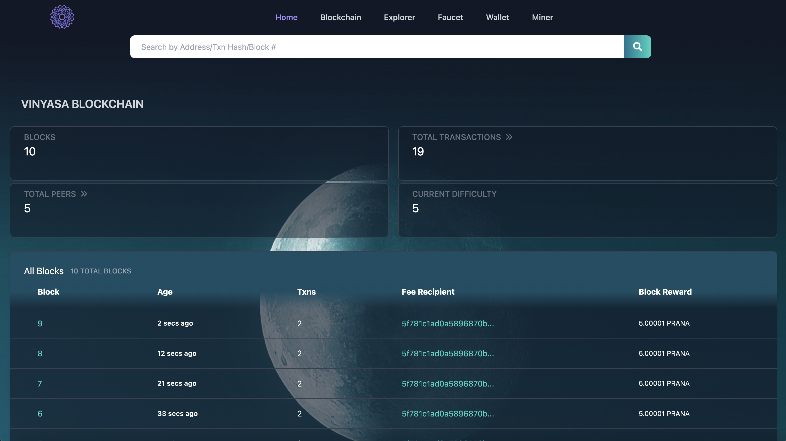

# VinyasaChain Educational Blockchain-Network

<p align="center">
  <a ></a></p>
</p>

## About The Project

Implemented a blockchain architecture complete with nodes, wallet, faucet, miner & block explorer.

## What I learned

This was a fun and challenging project. I was able to utilize all of my knowledge into one application. Enhancing my understanding of node interaction between peers, and how data flows to and from the blockchain was an enlightening experience. Every aspect of this project helped to further solidify my programming knowledge in all areas, but more specifically, blockchain.

## Installation

**You will be up and running in 4 simple steps**

```sh
// Step 1
npm install

// Step 2
npm start

// Step 3 RUN PEER NODES
Open separate terminals for each node
npm run node_1 (Genesis Node)
npm run node_2
npm run node_3
npm run node_4
npm run node_5

// Step 4
Open your browser and go to http://localhost:9999/
```

---

### Languages

- [JavaScript](https://www.javascript.com/)

### Built With

- [React.js](https://react.dev/)
- [Tailwind CSS](https://tailwindcss.com/)
- [Express](https://yarnpkg.com/package/express)

### Recommended Dependanices

- [Crypto-js](https://yarnpkg.com/package/crypto-js)
- [Elliptic](https://yarnpkg.com/package/elliptic)

---

## Features

---

### 1. Blockchain

<p align="center">
  <a ></a></p>
</p>

#### Functionality

- Displays all blocks and block information.
- Displays blocks & transactions total count.
- Displays total peers count and links to peer node info.
- Displays current Difficulty.
- Search bar for quick access to information.

---

### 2. Block Explorer

<p align="center">
  <a ></a></p>
</p>

#### Functionality

- Displays lastest blocks & transactions.
- Displays block information.
- Displays transaction information. (Pending & Confirmed).
- Displays transaction history of addresses.
- Displays balances (pending, confirmed, and safe) for addresses.
- Search bar for quick access to information.

---

### 3. Faucet

<p align="center">
  <a ></a></p>
</p>

#### Functionality

- Coin request limit is set to 5,000 PRANA
- Additional coins can be requested after a 90 second delay.
- Donate button lets you send coins back to the faucet
- The total balance of the faucet is displayed at all times.

---

### 4. Miner & Peer Nodes

<p align="center">
  <a ></a></p>
</p>

#### Functionality

- Sync miner to their connected wallet.
- Only mines if pending transactions are present.
- Validates Transactions.
- Block Validations.
- Multiple node synchronization.
- Mining Jobs.
- Consensus Verification.

---

### 5. Wallet

<p align="center">
  <a></a>
</p>

#### Key & Address Derivation

<p align="center">
  <a></a>
</p>
<p align="center">
  <a></a>
</p>

#### Sign & Send Transactions

<p align="center">
  <a></a>
</p>
<p align="center">
  <a></a>
</p>

#### Get Balances

<p align="center">
  <a></a>
</p>
<p align="center">
  <a></a>
</p>

#### Open Existing Wallet With Your Private Key

<p align="center">
  <a></a>
</p>
<p align="center">
  <a></a>
</p>

#### Functionality

- Wallet key & address derivation
- Wallet transaction sign & send
- Check balances
- Use a private key to restore the wallet

---


## Created By

- [Chadd Hohensee | LinkedIn](https://www.linkedin.com/in/chadd-hohensee)
